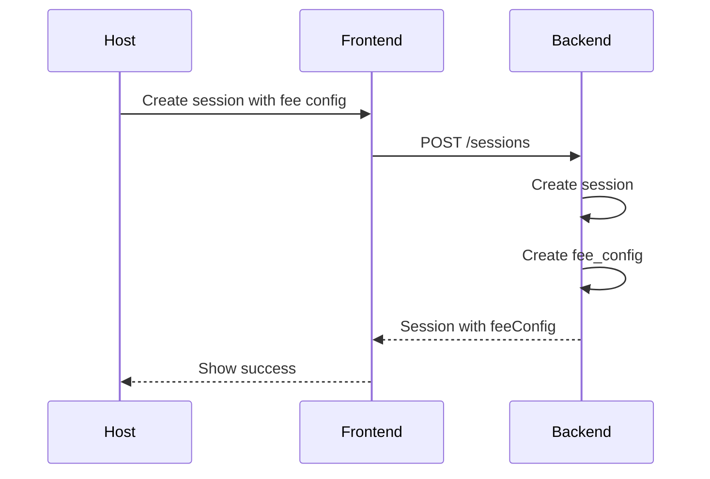
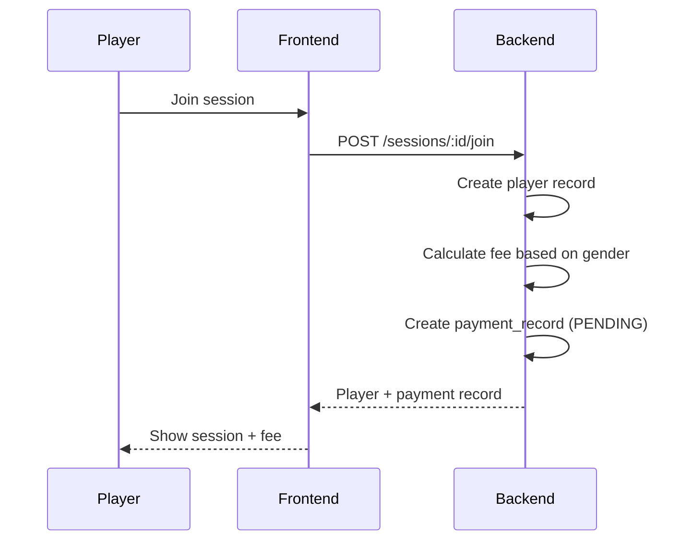
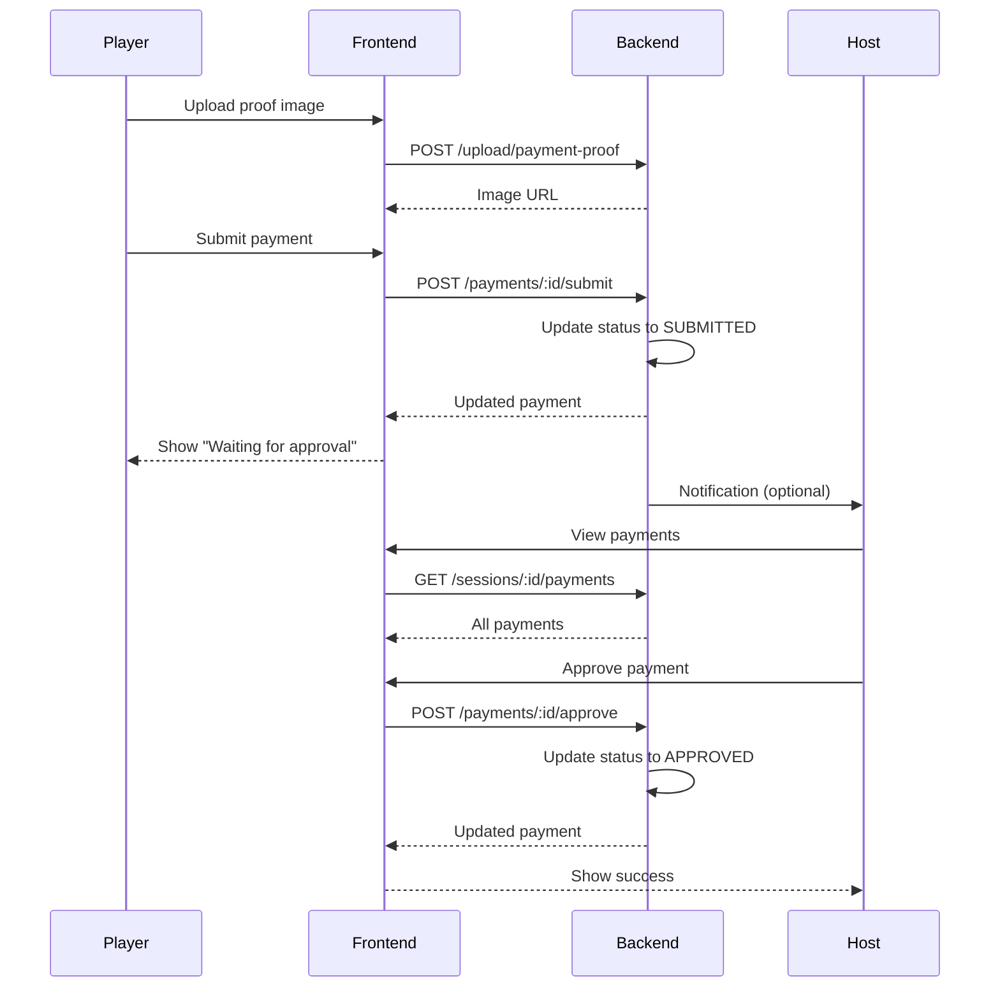
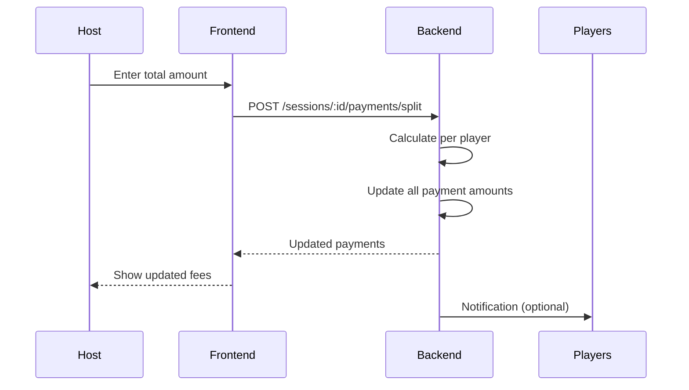

# Payment System - API Reference

**Last Updated:** 2026-01-28
**Version:** 1.0.0

## 📑 Table of Contents

1. [Overview](#overview)
2. [Architecture](#architecture)
3. [API Endpoints](#api-endpoints)
   - [Fee Configuration](#fee-configuration-api)
   - [Payment Settings](#payment-settings-api)
   - [Payment Records](#payment-records-api)
   - [Transactions](#transactions-api)
   - [File Upload](#file-upload-api)
4. [Frontend Services](#frontend-services)
5. [Data Flow](#data-flow)
6. [Error Handling](#error-handling)

---

## Overview

Payment system bao gồm 3 phần chính:

1. **Fee Configuration** - Cấu hình phí cho session
2. **Payment Settings** - Thông tin chuyển khoản của Host
3. **Payment Records** - Quản lý thanh toán của Players

### Key Features

- ✅ Fixed fee theo giới tính (Male/Female)
- ✅ Split evenly - Chia đều tổng chi phí
- ✅ Multi-slot support - Player có thể đăng ký nhiều slot
- ✅ Payment approval workflow (PENDING → SUBMITTED → APPROVED/REJECTED)
- ✅ QR code upload cho thanh toán nhanh
- ✅ Transaction history tracking

---

## Architecture

```
┌─────────────────────────────────────────────────────────┐
│                    Frontend (React)                      │
├─────────────────────────────────────────────────────────┤
│                                                           │
│  ┌──────────────┐  ┌──────────────┐  ┌──────────────┐  │
│  │ FeeService   │  │ PaymentSvc   │  │ PaymentSett- │  │
│  │              │  │              │  │ ingsService  │  │
│  └──────┬───────┘  └──────┬───────┘  └──────┬───────┘  │
│         │                  │                  │          │
└─────────┼──────────────────┼──────────────────┼──────────┘
          │                  │                  │
          ▼                  ▼                  ▼
┌─────────────────────────────────────────────────────────┐
│                  Backend API (/api)                      │
├─────────────────────────────────────────────────────────┤
│                                                           │
│  /sessions/:id/fee-config                                │
│  /sessions/:id/payments                                  │
│  /sessions/:id/my-payments                               │
│  /payment-settings                                       │
│  /payments/:id/submit                                    │
│  /payments/:id/approve                                   │
│  /transactions/summary                                   │
│  /upload/payment-proof                                   │
│  /upload/qr-code                                         │
│                                                           │
└───────────────────────────────────────────────────────────┘
```

---

## API Endpoints

### Fee Configuration API

#### 1. Get Session Fee Config

**Frontend Method:** `FeeService.getSessionFeeConfig(sessionId)`

```typescript
GET /api/sessions/:sessionId/fee-config
```

**Response:**
```json
{
  "success": true,
  "data": {
    "id": "uuid",
    "sessionId": "uuid",
    "feeType": "FIXED",
    "maleFee": 90000,
    "femaleFee": 80000,
    "splitTotal": null,
    "splitPerPlayer": null,
    "notes": "Phí bao gồm nước uống",
    "createdAt": "2026-01-28T00:00:00Z",
    "updatedAt": "2026-01-28T00:00:00Z"
  }
}
```

---

#### 2. Create Fee Config

**Frontend Method:** `FeeService.createSessionFeeConfig(sessionId, data)`

```typescript
POST /api/sessions/:sessionId/fee-config
```

**Request Body:**
```json
{
  "feeType": "FIXED",
  "maleFee": 90000,
  "femaleFee": 80000,
  "notes": "Phí bao gồm nước uống"
}
```

**Response:** Same as GET (201 Created)

---

#### 3. Update Fee Config

**Frontend Method:** `FeeService.updateSessionFeeConfig(sessionId, data)`

```typescript
PUT /api/sessions/:sessionId/fee-config
```

**Request Body:** Same as POST

**Side Effects:**
- Recalculates all payment_records amounts if fee changed
- Updates pending payments only

---

#### 4. Delete Fee Config

**Frontend Method:** `FeeService.deleteSessionFeeConfig(sessionId)`

```typescript
DELETE /api/sessions/:sessionId/fee-config
```

**Response:** 204 No Content

**Side Effects:**
- Deletes all associated payment_records

---

### Payment Settings API

#### 1. Get My Payment Settings

**Frontend Method:** `PaymentSettingsService.getMyPaymentSettings()`

```typescript
GET /api/payment-settings
```

**Response:**
```json
{
  "success": true,
  "data": [
    {
      "id": "uuid",
      "userId": "uuid",
      "bankName": "Vietcombank",
      "bankAccountNumber": "1234567890",
      "accountHolderName": "NGUYEN VAN A",
      "qrCodeUrl": "https://storage.example.com/qr/abc.png",
      "isDefault": true,
      "createdAt": "2026-01-28T00:00:00Z",
      "updatedAt": "2026-01-28T00:00:00Z"
    }
  ]
}
```

---

#### 2. Get Default Payment Settings

**Frontend Method:** `PaymentSettingsService.getDefaultPaymentSettings()`

```typescript
GET /api/payment-settings/default
```

**Response:** Single payment setting object or null

---

#### 3. Get Host Payment Settings (For Players)

**Frontend Method:** `PaymentSettingsService.getHostPaymentSettings(hostId)`

```typescript
GET /api/hosts/:hostId/payment-settings
```

**Response:** Returns only the default payment setting of the host

---

#### 4. Create Payment Settings

**Frontend Method:** `PaymentSettingsService.createPaymentSettings(data)`

```typescript
POST /api/payment-settings
```

**Request Body:**
```json
{
  "bankName": "Vietcombank",
  "bankAccountNumber": "1234567890",
  "accountHolderName": "NGUYEN VAN A",
  "qrCodeUrl": "https://...",
  "isDefault": true
}
```

**Validation:**
- All fields are optional
- `qrCodeUrl` must be a valid URL if provided
- At least one field (bankName, bankAccountNumber, or qrCodeUrl) is recommended

**Side Effects:**
- If isDefault=true, sets all other settings to isDefault=false

---

#### 5. Update Payment Settings

**Frontend Method:** `PaymentSettingsService.updatePaymentSettings(id, data)`

```typescript
PUT /api/payment-settings/:id
```

**Request Body:** Same as POST (all fields optional)

**Validation:**
- `qrCodeUrl` must be a valid URL if provided
- Omit `qrCodeUrl` field entirely (don't send `undefined`) to remove QR code

---

#### 6. Delete Payment Settings

**Frontend Method:** `PaymentSettingsService.deletePaymentSettings(id)`

```typescript
DELETE /api/payment-settings/:id
```

**Response:** 204 No Content

---

#### 7. Set as Default

**Frontend Method:** `PaymentSettingsService.setDefaultPaymentSettings(id)`

```typescript
POST /api/payment-settings/:id/set-default
```

**Side Effects:**
- Sets all other settings for this user to isDefault=false

---

### Payment Records API

#### 1. Get My Session Payments (Player)

**Frontend Method:** `PaymentService.getMySessionPayments(sessionId)`

```typescript
GET /api/sessions/:sessionId/my-payments
```

⚠️ **Status:** Backend implementation pending - Currently returns 404

**Expected Implementation:**
- Filter payments where `registeredByUserId` matches authenticated user
- Return array of payment records (may be multiple for multi-slot)

**Response:**
```json
{
  "success": true,
  "data": [
    {
      "id": "uuid",
      "sessionId": "uuid",
      "playerId": "uuid",
      "registeredByUserId": "uuid",
      "hostId": "uuid",
      "amount": 90000,
      "paymentMethod": "BANK_TRANSFER",
      "status": "PENDING",
      "proofImageUrl": null,
      "proofNotes": null,
      "hostNotes": null,
      "submittedAt": null,
      "approvedAt": null,
      "rejectedAt": null,
      "player": {
        "id": "uuid",
        "name": "Player Name",
        "gender": "MALE"
      }
    }
  ]
}
```

**Note:** Returns multiple records if user registered multiple slots

---

#### 2. Get Session Payments (Host)

**Frontend Method:** `PaymentService.getSessionPayments(sessionId)`

```typescript
GET /api/sessions/:sessionId/payments
```

**Query Parameters:**
- `status`: Filter by status (PENDING, SUBMITTED, APPROVED, REJECTED)
- `paymentMethod`: Filter by method (CASH, BANK_TRANSFER)

**Response:**
```json
{
  "success": true,
  "data": [
    {
      "id": "uuid",
      "sessionId": "uuid",
      "playerId": "uuid",
      "amount": 90000,
      "status": "SUBMITTED",
      "paymentMethod": "BANK_TRANSFER",
      "proofImageUrl": "https://...",
      "proofNotes": "Đã chuyển lúc 10h sáng",
      "submittedAt": "2026-01-28T10:00:00Z",
      "player": {
        "id": "uuid",
        "name": "Player Name",
        "gender": "MALE",
        "user": {
          "id": "uuid",
          "name": "User Name",
          "image": "https://..."
        }
      }
    }
  ]
}
```

---

#### 3. Submit Payment (Player)

**Frontend Method:** `PaymentService.submitPayment(paymentId, data)`

```typescript
POST /api/payments/:id/submit
```

**Request Body:**
```json
{
  "paymentMethod": "BANK_TRANSFER",
  "proofImageUrl": "https://...",
  "proofNotes": "Đã chuyển lúc 10h sáng"
}
```

**Validation:**
- Only player or registering user can submit
- Status must be PENDING or REJECTED

**Side Effects:**
- Status → SUBMITTED
- submittedAt → now

---

#### 4. Approve Payment (Host)

**Frontend Method:** `PaymentService.approvePayment(paymentId, data?)`

```typescript
POST /api/payments/:id/approve
```

**Request Body:**
```json
{
  "hostNotes": "Đã nhận tiền"
}
```

**Validation:**
- Only session host can approve
- Status must be SUBMITTED

**Side Effects:**
- Status → APPROVED
- approvedAt → now

---

#### 5. Reject Payment (Host)

**Frontend Method:** `PaymentService.rejectPayment(paymentId, data)`

```typescript
POST /api/payments/:id/reject
```

**Request Body:**
```json
{
  "hostNotes": "Số tiền không đúng, vui lòng chuyển 90.000đ"
}
```

**Validation:**
- Only session host can reject
- Status must be SUBMITTED

**Side Effects:**
- Status → REJECTED
- rejectedAt → now

---

#### 6. Bulk Approve Payments

**Frontend Method:** `PaymentService.bulkApprovePayments(paymentIds)`

```typescript
POST /api/payments/bulk-approve
```

**Request Body:**
```json
{
  "paymentIds": ["uuid1", "uuid2", "uuid3"],
  "hostNotes": "Đã nhận tất cả"
}
```

**Response:**
```json
{
  "success": true,
  "data": [
    // Array of approved payment records
  ]
}
```

---

#### 7. Set Split Amount (Host)

**Frontend Method:** `PaymentService.setSplitAmount(sessionId, totalAmount)`

```typescript
POST /api/sessions/:sessionId/payments/split
```

**Request Body:**
```json
{
  "totalAmount": 1000000
}
```

**Note:** For SPLIT_EVENLY fee type only

**Side Effects:**
- Calculates splitPerPlayer = totalAmount / totalPlayers
- Updates all payment_records.amount for this session

---

#### 8. Get Payment Stats

**Frontend Method:** `PaymentService.getSessionPaymentStats(sessionId)`

```typescript
GET /api/sessions/:sessionId/payments/stats
```

**Response:**
```json
{
  "success": true,
  "data": {
    "totalPlayers": 10,
    "totalAmount": 900000,
    "paidAmount": 360000,
    "pendingAmount": 540000,
    "submittedCount": 2,
    "approvedCount": 4,
    "pendingCount": 3,
    "rejectedCount": 1
  }
}
```

---

### Transactions API

#### 1. Get Player Transaction Summary

**Frontend Method:** `PaymentService.getMyTransactionSummary()`

```typescript
GET /api/transactions/summary
```

**Response:**
```json
{
  "success": true,
  "data": [
    {
      "hostId": "uuid",
      "hostName": "Host Name",
      "hostImage": "https://...",
      "totalSessions": 5,
      "totalAmount": 450000,
      "paidAmount": 360000,
      "pendingAmount": 90000
    }
  ]
}
```

---

#### 2. Get Transactions with Host

**Frontend Method:** `PaymentService.getMyTransactionsWithHost(hostId)`

```typescript
GET /api/transactions/with-host/:hostId
```

**Response:**
```json
{
  "success": true,
  "data": [
    {
      "id": "uuid",
      "sessionId": "uuid",
      "amount": 90000,
      "status": "APPROVED",
      "session": {
        "id": "uuid",
        "name": "Session Name",
        "startTime": "2026-01-28T18:00:00Z"
      }
    }
  ]
}
```

---

#### 3. Get Host Transaction Summary

**Frontend Method:** `PaymentService.getHostTransactionSummary()`

```typescript
GET /api/host/transactions/summary
```

**Response:**
```json
{
  "success": true,
  "data": [
    {
      "userId": "uuid",
      "userName": "Player Name",
      "userImage": "https://...",
      "totalSessions": 5,
      "totalAmount": 450000,
      "paidAmount": 360000,
      "pendingAmount": 90000
    }
  ]
}
```

---

#### 4. Get Transactions with User

**Frontend Method:** `PaymentService.getHostTransactionsWithUser(userId)`

```typescript
GET /api/host/transactions/with-user/:userId
```

**Response:** Similar to player version

---

### File Upload API

#### 1. Upload QR Code

**Frontend Method:** `PaymentSettingsService.uploadQRCode(file)`

```typescript
POST /api/upload/qr-code
```

**Request:** multipart/form-data with file field **"qrCode"**

**Response:**
```json
{
  "success": true,
  "data": {
    "url": "https://storage.example.com/qr-codes/abc123.png"
  }
}
```

---

#### 2. Upload Payment Proof

**Frontend Method:** `PaymentService.uploadPaymentProof(file)`

```typescript
POST /api/upload/payment-proof
```

**Request:** multipart/form-data with file field **"proof"**

**Response:**
```json
{
  "success": true,
  "data": {
    "url": "https://storage.example.com/payment-proofs/xyz789.png"
  }
}
```

---

## Frontend Services

### FeeService

**Location:** `src/lib/api/fee.service.ts`

```typescript
import { FeeService } from '@/lib/api/fee.service';

// Get fee config
const feeConfig = await FeeService.getSessionFeeConfig(sessionId);

// Create fee config
const created = await FeeService.createSessionFeeConfig(sessionId, {
  feeType: 'FIXED',
  maleFee: 90000,
  femaleFee: 80000,
  notes: 'Phí bao gồm nước'
});

// Calculate fee for player
const fee = FeeService.calculatePlayerFee(feeConfig, 'MALE', 1); // 90000

// Format fee for display
const display = FeeService.formatFee(90000); // "90k"
const range = FeeService.getFeeDisplayText(feeConfig); // "80k - 90k"
```

---

### PaymentService

**Location:** `src/lib/api/payment.service.ts`

```typescript
import { PaymentService } from '@/lib/api/payment.service';

// Player: Get my payments
const myPayments = await PaymentService.getMySessionPayments(sessionId);

// Player: Submit payment
await PaymentService.submitPayment(paymentId, {
  paymentMethod: 'BANK_TRANSFER',
  proofImageUrl: 'https://...',
  proofNotes: 'Đã chuyển'
});

// Player: Upload proof
const url = await PaymentService.uploadPaymentProof(file);

// Player: Get transaction summary
const summary = await PaymentService.getMyTransactionSummary();

// Host: Get all payments
const payments = await PaymentService.getSessionPayments(sessionId);

// Host: Approve payment
await PaymentService.approvePayment(paymentId, {
  hostNotes: 'Đã nhận'
});

// Host: Reject payment
await PaymentService.rejectPayment(paymentId, {
  hostNotes: 'Số tiền không đúng'
});

// Host: Bulk approve
await PaymentService.bulkApprovePayments(['id1', 'id2']);

// Host: Set split amount
await PaymentService.setSplitAmount(sessionId, 1000000);

// Host: Get stats
const stats = await PaymentService.getSessionPaymentStats(sessionId);
```

---

### PaymentSettingsService

**Location:** `src/lib/api/payment-settings.service.ts`

```typescript
import { PaymentSettingsService } from '@/lib/api/payment-settings.service';

// Get my settings
const settings = await PaymentSettingsService.getMyPaymentSettings();

// Get default
const defaultSetting = await PaymentSettingsService.getDefaultPaymentSettings();

// Get host settings (for players)
const hostSettings = await PaymentSettingsService.getHostPaymentSettings(hostId);

// Create settings
const created = await PaymentSettingsService.createPaymentSettings({
  bankName: 'Vietcombank',
  bankAccountNumber: '1234567890',
  accountHolderName: 'NGUYEN VAN A',
  qrCodeUrl: 'https://...',
  isDefault: true
});

// Update settings
const updated = await PaymentSettingsService.updatePaymentSettings(id, {
  bankName: 'Techcombank'
});

// Delete settings
await PaymentSettingsService.deletePaymentSettings(id);

// Set as default
await PaymentSettingsService.setDefaultPaymentSettings(id);

// Upload QR code
const url = await PaymentSettingsService.uploadQRCode(file);
```

---

## Data Flow

### 1. Session Creation with Fee



---

### 2. Player Joins Session



---

### 3. Payment Submission Flow



---

### 4. Split Evenly Flow



---

## Error Handling

### Common Error Codes

| Code | HTTP Status | Description | Frontend Action |
|------|-------------|-------------|-----------------|
| `UNAUTHORIZED` | 401 | Not authenticated | Redirect to login |
| `FORBIDDEN` | 403 | Not authorized | Show error message |
| `NOT_FOUND` | 404 | Resource not found | Show not found page |
| `VALIDATION_ERROR` | 400 | Invalid request data | Show field errors |
| `CONFLICT` | 409 | Resource already exists | Show conflict message |

---

### Error Response Format

```json
{
  "success": false,
  "error": {
    "code": "PAYMENT_NOT_FOUND",
    "message": "Payment record not found"
  }
}
```

---

### Frontend Error Handling

All service methods use toaster for user feedback:

```typescript
try {
  await PaymentService.submitPayment(id, data);
  // toaster.success is called automatically
} catch (error) {
  // Error is automatically caught and shown
  console.error(error);
}
```

---

## Best Practices

### 1. Always Check Fee Config Before Showing Payment UI

```typescript
const feeConfig = await FeeService.getSessionFeeConfig(sessionId);
if (!feeConfig) {
  // Show "No fee configured" message
  return;
}
```

---

### 2. Validate Payment Status Before Actions

```typescript
// Player can only submit if PENDING or REJECTED
if (payment.status !== 'PENDING' && payment.status !== 'REJECTED') {
  // Don't show submit button
}

// Host can only approve/reject if SUBMITTED
if (payment.status !== 'SUBMITTED') {
  // Don't show approve/reject buttons
}
```

---

### 3. Handle Multi-Slot Payments

```typescript
// A user may have multiple payment records (multi-slot)
const myPayments = await PaymentService.getMySessionPayments(sessionId);
const totalAmount = myPayments.reduce((sum, p) => sum + p.amount, 0);
```

---

### 4. Refresh Data After Actions

```typescript
await PaymentService.approvePayment(paymentId);
// Refresh list
await fetchPaymentData();
```

---

## Related Documentation

- [API Spec - Fee & Payment](./api-spec-fee-payment.md)
- [Payment Tab Component](../src/components/session/PaymentTab.tsx)
- [Payment Info Tab Component](../src/components/payment/PaymentInfoTab.tsx)

---

**End of Document**
